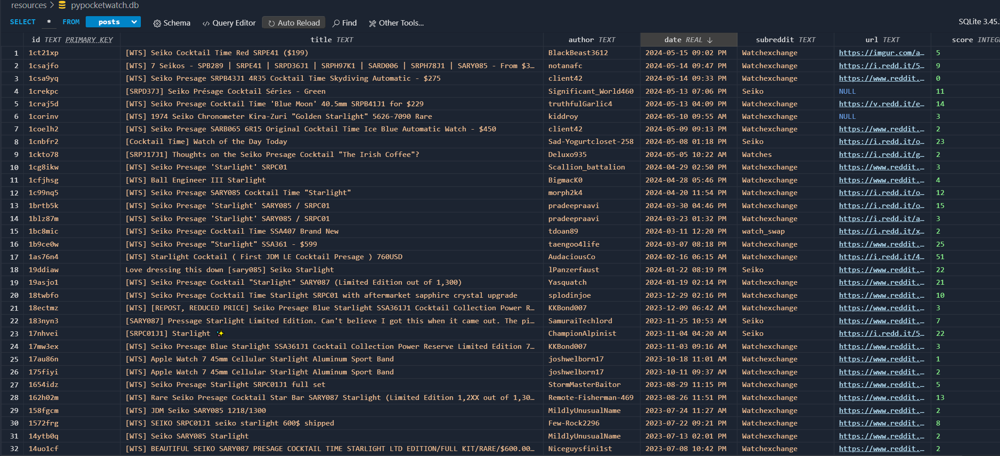

# pypocketwatch
## May 2024
A pulse monitor running on RPI4 (Watson) to scrape, filter, and report any and all noise on Reddit relating to the sale of the Seiko SARY085, my favorite watch.


Checks subreddits on a routine basis and tells you if it found anything _notable_.

I don't use the site and I definitely don't want to do a routine search daily. Simply put, if a ~~robot~~ [Watson](#automation) does it for me I can spend more time playing TOTK, TTYD Remake (soon), or Lego Star Wars. I have no idea how all my favorite games are being remade, but life is good.

In my case, what is _notable_ is the [Seiko Presage "Starlight" SRPC01](https://www.watchgecko.com/blogs/magazine/thoughts-on-the-seiko-presage-cocktail-time-starlight). Never been a big watch guy, but after seeing this, now a big watch guy.

## Cool Pictures
Yea, probably shouldn't upload a bunch of images to the repo itself, but I don't care.

(Watson + beautiful cable management)


(Database - It works?!?!)



I thought there'd be more cool pictures but I guess I can do a better job of documenting next time. This was cool though, ask me about it.

## How
YouTube tutorials, my favorite Python [requests](https://pypi.org/project/requests/) library, and a dream.

I can interpret the data with [regex](https://docs.python.org/3/library/re.html) to see if it is what I am looking for. After finding something I want, I can use check for ${...} and find their price as well as other info about the post.

I am using [sqlite3](https://docs.python.org/3/library/sqlite3.html) as a lightweight container for my results. I can also store the last date queried, so I don't overquery.

## Constraints
1. Be on one of the subreddits I specify.
2. Be the watch I am looking for (name regex).
3. Only query a reasonable amount per day, the [Reddit API](https://www.reddit.com/dev/api/) has "limits".

## Automation
I could probably get this script running with [GitHub Actions](https://docs.github.com/en/actions) or something, but I've been letting **this guy** sit around collecting dust.

(this guy, now named **Watson**.)


Glad I took the time to set [Watson](https://www.raspberrypi.com/products/raspberry-pi-4-model-b/) up (he has been waiting 5 years) as now I have a compute engine I can ssh into and work from on my local machine for free (except power of course).

My mind races at what else I can do now, but I'll keep it to this project.

I knew there'd be a daemon or system task scheduler, and google yielded [crontab](https://www.geeksforgeeks.org/crontab-in-linux-with-examples/), which was simple enough for setting up a basic script to run. This was the only line I added in my `crontab -e`:

```sh
0 0 * * * /usr/bin/python3 /longpathfromroot/Desktop/fun/pypocketwatch/src/main.py
```

It updates a local database, which is good enough for me. I can check it every day (sorting rows by date) with ease. Later on I'll probably add a connection or means of emailing me if it finds something.

## Up Next
- [ ] Make it reach out to me if something happens, so I don't even have to check.
- [ ] Wait... I did all this - but I'm still broke...
- [ ] Get money (hire me?)

## Technologies I Used
- Python
  - SQLite3
  - requests
  - regex
  - logging
- Raspberry Pi 4
  - the manual, lol
  - linux + os & systems knowledge
  - ssh, keygen
  - crontab
- The Internet
  - [Reddit API](https://www.reddit.com/dev/api/)
  - [YouTube](https://www.youtube.com/)
  - [tutorial / wireframe for parsing reddit](https://www.youtube.com/watch?v=Se3GEUY3AGI)
  - [This guys rpi cheatsheet](https://github.com/LukaszLapaj/raspberry-pi-cheat-sheet)
