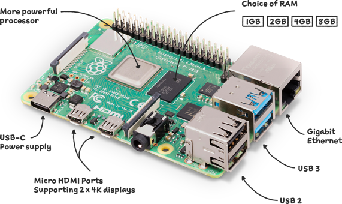

# pypocketwatch

Checks subreddits on a routine basis and tells you if it found anything _notable_.

I don't use the site and I definitely don't want to do a routine search daily. Simply put, if a ~~robot~~ [Watson](#automation) does it for me I can spend more time playing Tears of the Kingdom.

In my case, what is _notable_ is the [Seiko Presage "Starlight" SRPC01](https://www.watchgecko.com/blogs/magazine/thoughts-on-the-seiko-presage-cocktail-time-starlight). Never been a big watch guy, but after seeing this, now a big watch guy.

In other words, it **pocket watches** all information relating to anything you want to track over time.

## Constraints
1. Be on one of the subreddits I specify.
2. Be the watch I am looking for (name regex).
3. Only query a reasonable amount per day, the [Reddit API](https://www.reddit.com/dev/api/) has "limits".

## How
YouTube tutorials, my favorite Python [requests](https://pypi.org/project/requests/) library, and a dream.

I can interpret the data with [regex](https://docs.python.org/3/library/re.html) to see if it is what I am looking for. After finding something I want, I can use check for ${...} and find their price as well as other info about the post.

I am using [sqlite3](https://docs.python.org/3/library/sqlite3.html) as a lightweight container for my results. I can also store the last date queried, so I don't overquery.

## Automation
I could probably get this script running with [GitHub Actions](https://docs.github.com/en/actions) or something, but I've been letting **this guy** sit around collecting dust.

(this guy, now named **Watson** - not named for the reason you think)

Glad I took the time to set [Watson](https://www.raspberrypi.com/products/raspberry-pi-4-model-b/) up (he has been waiting ~5 years) as now I have a compute engine I can ssh into and work from on my local machine for free (except power of course).

Now that Watson is up and running, my mind races at what else we can achieve. Well, I'll keep it enclosed to this for now.

## Cool Pictures

## Other Resources
- [Wireframe for parsing reddit](https://www.youtube.com/watch?v=Se3GEUY3AGI)
- [Reddit API Documentation](https://www.reddit.com/dev/api/)
- [RPI Cheatsheet](https://www.reddit.com/r/raspberry_pi/comments/mcfdwn/raspberry_pi_4_cheat_sheet_quick_start_guide/)